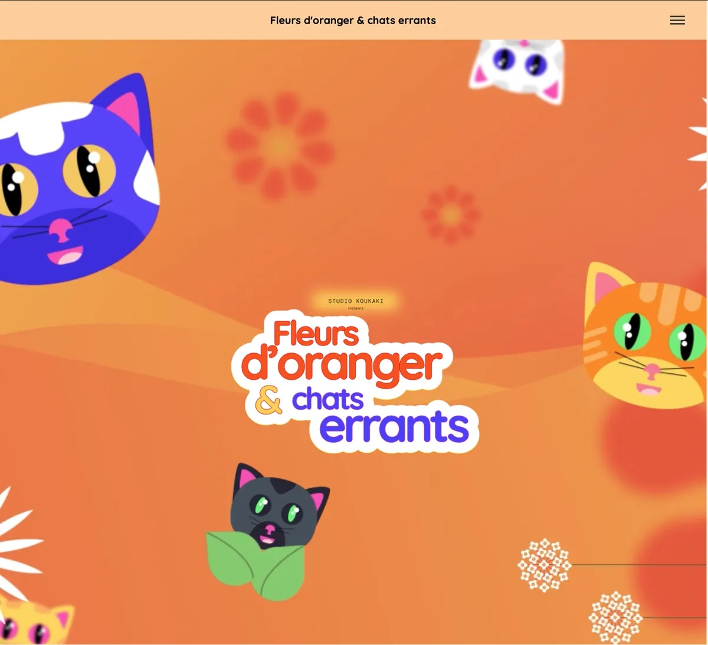
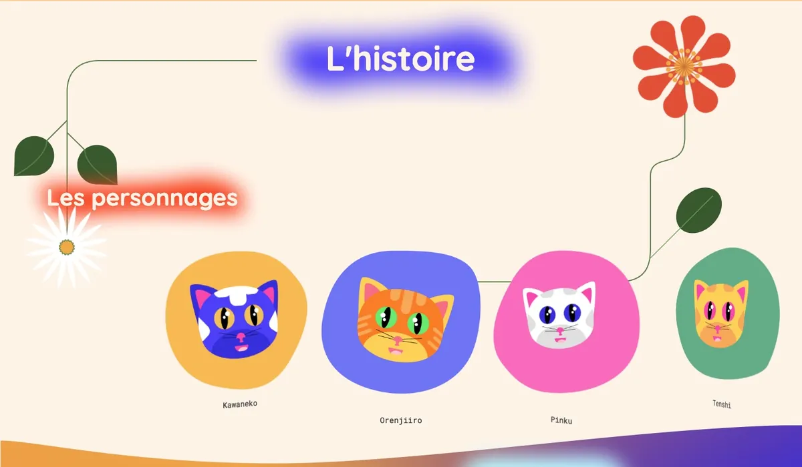
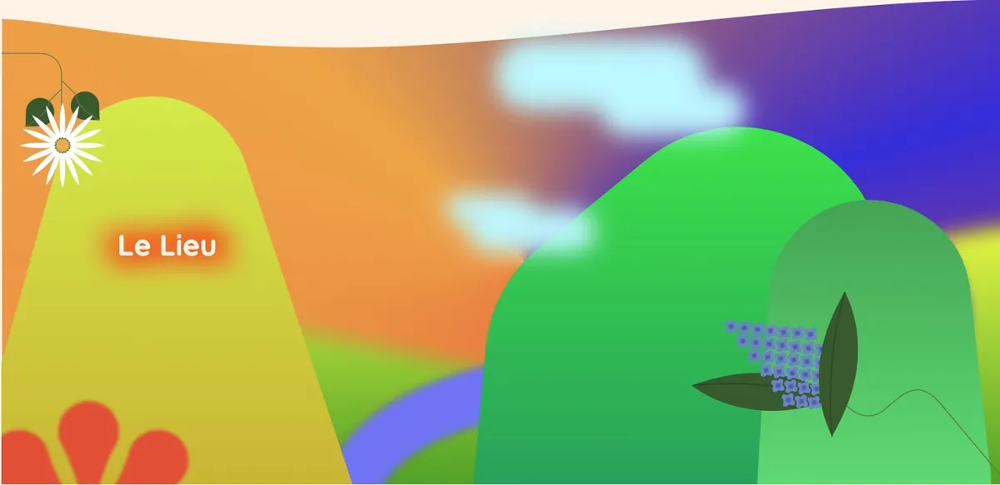
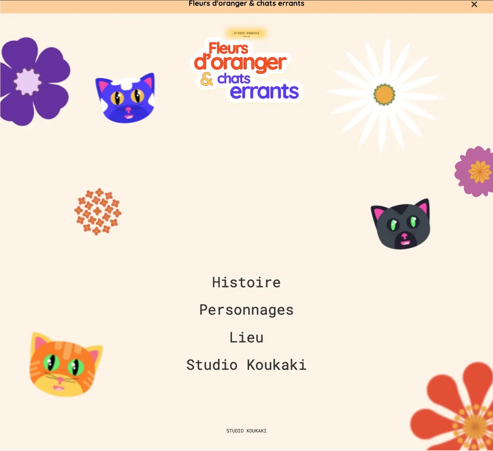
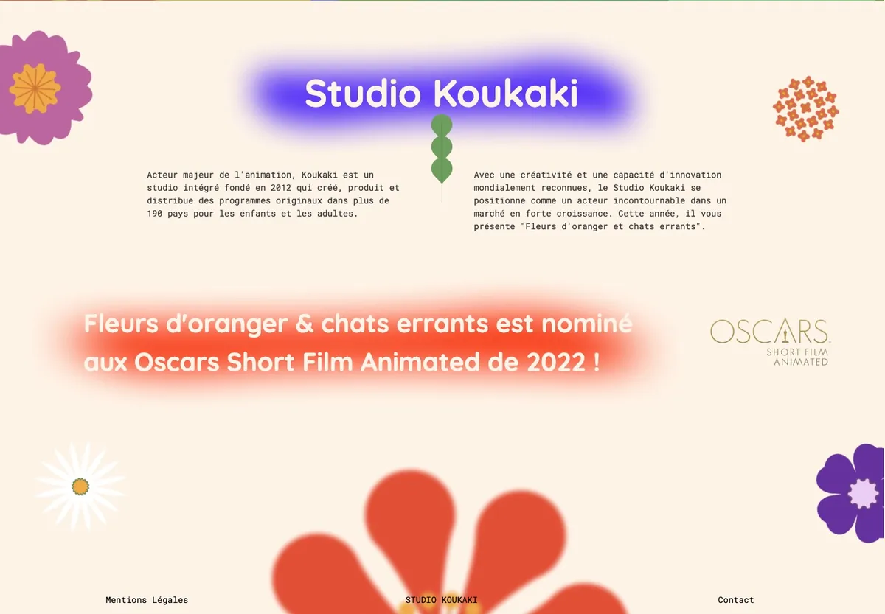
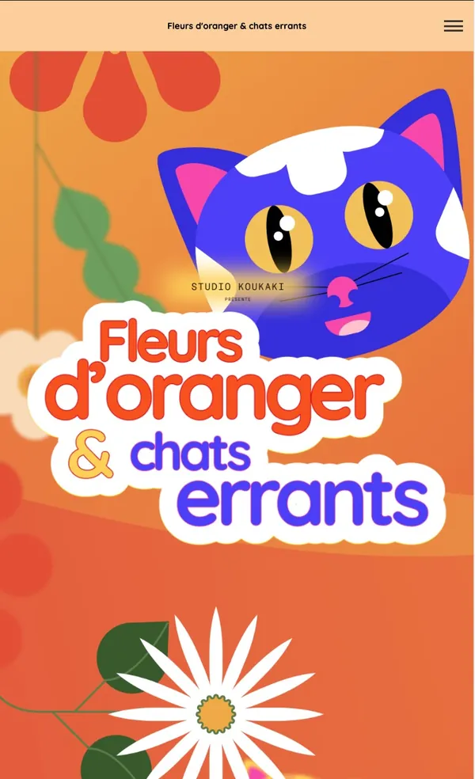

# Studio Koukaki : donner vie à un site avec des animations

> **Projet de formation OpenClassrooms — client fictif.**
> Parcours « Développeur WordPress », projet 9 · mars – avril 2026 ·
> Juliette Béthery.

Ce dépôt contient le **thème enfant** `foce-child` du site du studio
d'animation Koukaki. Il ne contient ni WordPress, ni le thème parent `foce`,
ni les médias fournis pour le projet (vidéo et images).

## Contexte

Le studio Koukaki voit son court-métrage *Fleurs d'oranger & chats errants*
nominé aux Oscars. Il veut rendre la page d'accueil de son site plus vivante,
à partir d'une maquette et d'un prototype Figma.

Contraintes : travailler uniquement dans le thème enfant, **sans page
builder**, écrire **tout le CSS en Sass**, intégrer les scripts selon les
bonnes pratiques de WordPress, et **peser l'intérêt de chaque bibliothèque**
au regard de la vitesse de chargement.

## Les cinq demandes du studio

| Demande | Réalisation |
|---|---|
| **Affichage général** : sections en fondu au chargement, fleurs qui tournent, titres qui apparaissent au défilement, section Oscars | Animations CSS `@keyframes` ; titres déclenchés par `IntersectionObserver` (sans bibliothèque) ; section Oscars dans un gabarit partiel, facile à retirer après l'événement |
| **En-tête** : vidéo en fond, titre qui flotte, parallaxe entre titre et vidéo | Vidéo en lecture automatique, en boucle, sans son ni contrôles, sur ordinateur et tablette ; image d'origine conservée sur mobile et pendant le chargement ; flottement en CSS ; parallaxe calculée en JavaScript |
| **Personnages** : carrousel | SwiperJS, effet « Cover Flow », dans un gabarit partiel ; personnages lus par une `WP_Query` sur le type de contenu `characters` |
| **Lieu** : nuages qui se décalent de 300 px vers la gauche au défilement | Calcul en JavaScript selon la position de la section, déplacement plafonné à 300 px, retour à droite quand on remonte |
| **Menu** : menu plein écran au clic sur le burger | Overlay plein écran, liens qui apparaissent l'un après l'autre, effet au survol, fermeture au clic sur un lien |

### Extrait : les titres qui apparaissent au défilement

```js
const elements = document.querySelectorAll('h2, h3');
const observer = new IntersectionObserver(function (entries) {
  entries.forEach(function (entry) {
    if (entry.isIntersecting) {
      entry.target.classList.add('is-visible'); // l'animation CSS prend le relais
      observer.unobserve(entry.target);          // une seule fois par titre
    }
  });
}, { threshold: 0.4 });
elements.forEach(function (el) { observer.observe(el); });
```

`IntersectionObserver` prévient le script quand un titre entre dans l'écran :
pas de calcul à chaque pixel de défilement, et aucune bibliothèque à charger.

## Captures

**En-tête : vidéo en fond et titre flottant**



**Carrousel des personnages (SwiperJS, effet Cover Flow)**



**Section du lieu : les nuages se décalent au défilement**



**Menu plein écran**



**Section consacrée à la nomination aux Oscars**



**Sur téléphone : l'image fixe remplace la vidéo**



## Contenu du dépôt

```
foce-child/
├── style.css                      en-tête du thème enfant
├── functions.php                  chargement des styles et scripts (wp_enqueue_*)
├── header.php                     menu burger plein écran
├── front-page.php                 page d'accueil : vidéo, sections, appels aux gabarits partiels
├── footer.php
├── template-parts/
│   ├── characters.php             carrousel des personnages (SwiperJS)
│   └── oscar-animation.php        section Oscars
├── sass/main.scss                 source Sass, organisée par étape du cahier des charges
├── css/main.css                   CSS compilé depuis le Sass (celui que WordPress charge)
├── js/animations.js               menu, titres au défilement, parallaxes, carrousel
└── captures/                      captures d'écran (WebP)
```

## Installation

1. Installer WordPress et le thème parent `foce` (fourni avec le projet).
2. Copier `foce-child/` dans `wp-content/themes/` et l'activer.
3. Le CSS compilé est fourni dans `css/main.css`. Pour le régénérer après une
   modification du Sass : `sass sass/main.scss css/main.css`
4. Placer les médias fournis (vidéo et images) dans `assets/video_koukaki/` et
   `assets/images_koukaki/`. Ils ne sont pas versionnés.

## Compétences mobilisées

JavaScript (manipulation du DOM, `IntersectionObserver`, événements) ·
Animations CSS · Sass · SwiperJS · Thème enfant WordPress · `WP_Query` ·
Gabarits partiels · `wp_enqueue_script` · Responsive · Git

## Évaluation

Projet validé : tous les critères techniques sont remplis (scripts intégrés via
`functions.php`, menu plein écran, carrousel Cover Flow, nuages sur 300 px,
titres au défilement, fondus, fleurs, vidéo avec image de repli, effet au
survol, animation écrite en Sass, CSS et Sass fournis). Les deux corrections
demandées pendant la soutenance ont été apportées.

## Ce que je ferais autrement aujourd'hui

- Respecter le réglage « réduire les animations » du visiteur
  (`prefers-reduced-motion`).
- Héberger SwiperJS dans le thème plutôt que le charger depuis un CDN : une
  ressource externe de moins, et aucune adresse IP de visiteur transmise à un
  tiers.
- Retirer la dépendance à jQuery déclarée dans `functions.php` : le script est
  écrit en JavaScript natif.
- Découper le JavaScript par fonctionnalité (menu, carrousel, parallaxe) pour
  qu'il soit plus facile à lire et à faire évoluer — c'est le principal axe
  d'amélioration relevé à l'évaluation.
